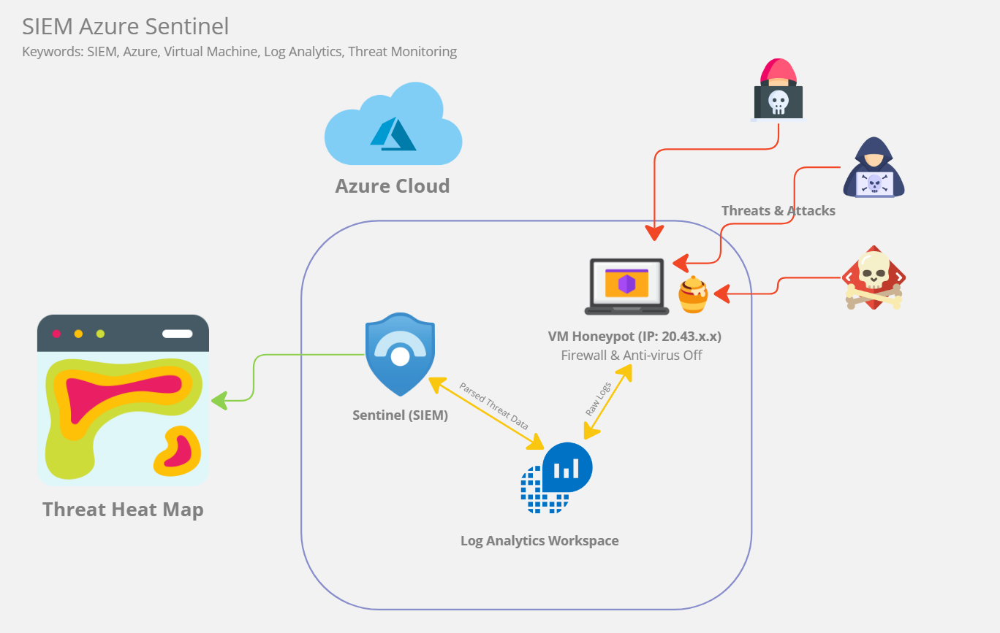
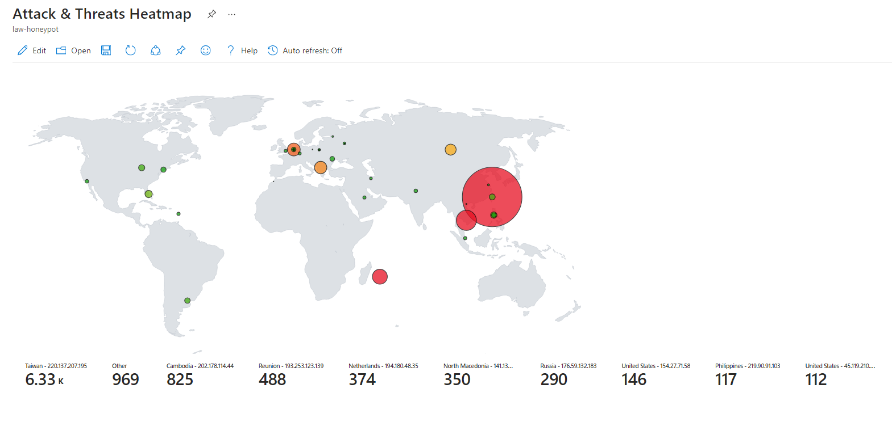

# SIEM Azure Sentinel Honeypot 

**Honeypot** and **SIEM** (Security Information Event Manager) using **Microsoft Azure** cloud.

## Summary

In this project, a <b>Virtual Machine</b> (VM) honeypot hosted on <b>Microsoft Azure</b> cloud is intentionally exposed to the internet, with both Firewall and Anti-virus disabled. Utilized <b>Log Analytics</b>
to collect and process raw logs from the honeypot, capturing threats in real-time. Leveraged <b>Sentinel</b>, Microsoft's cloud-native SIEM to plot aggregated threat data onto the map, providing a comprehensive visual representation of global threat landscapes encountered by the honeypot.   
To further enrich the data during visualization, IP addresses are translated into  geographical attributes, such as <code>Latitude</code>, <code>Longtitude</code> and <code>City</code> using <code>Ip-to-Geolocation</code> API services. This enabled us to build more precise queries and better visualize the distribution of threats across different countries.

